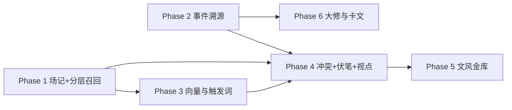

# 智能检索与上下文管理 — 分阶段路线图

**依据规格：**  
[`docs/superpowers/specs/2026-04-05-intelligent-retrieval-context-management-design.md`](../../superpowers/specs/2026-04-05-intelligent-retrieval-context-management-design.md)  
[`docs/superpowers/specs/2026-04-05-intelligent-retrieval-context-management-design-part2.md`](../../superpowers/specs/2026-04-05-intelligent-retrieval-context-management-design-part2.md)

**代码根目录：** `aitext/`（FastAPI + SQLite 为主，文件型伏笔仓储已存在）

**仓库对齐（勾选状态）：** 2026-04-05 起，各 Phase 文档中的 `- [x]` / `- [ ]` 已与当前 `d:\CODE\aitext` 代码树核对（路径以仓库根为准：`application/`、`interfaces/` 等，而非文中的 `aitext/` 前缀）。未勾选项表示代码中仍缺或仅为占位。

---

## 阶段依赖（必须按序或可并行标注）

| 阶段 | 文档 | 规格模块 | 交付物摘要 |
|------|------|----------|------------|
| **1** | [phase1](./2026-04-05-intelligent-retrieval-context-management-phase1.md) | 一、三（部分）、四（统计） | 场记 API、`build_structured_context`、context/retrieve |
| **2** | [phase2](./2026-04-05-intelligent-retrieval-context-management-phase2.md) | 二 | `entity_base` + `narrative_events` SQLite、重放查询 |
| **3** | [phase3](./2026-04-05-intelligent-retrieval-context-management-phase3.md) | 三、四（截断强化） | Qdrant/Embedding 接入 Layer2、触发词表、±10 章窗口 |
| **4** | [phase4](./2026-04-05-intelligent-retrieval-context-management-phase4.md) | 五、六（部分） | 冲突检测与批注 DTO、潜台词账本、public/hidden 视点过滤、场记「表演指令」 |
| **5** | [phase5](./2026-04-05-intelligent-retrieval-context-management-phase5.md) | 七 | `voice_vault` / `voice_fingerprint`、俗套检测、漂移评分 API |
| **6** | [phase6](./2026-04-05-intelligent-retrieval-context-management-phase6.md) | 全局大修、沙盘、卡文破局 | 事件断点扫描 API、沙盘分支占位、张力弹弓 What-If API |

**可选基础设施（跨阶段）：** Celery + Redis 仅当「场记/嵌入」需与请求线程彻底解耦时再引入；规格中的 PostgreSQL JSONB 在 `aitext` 中统一映射为 **SQLite TEXT(JSON)** + 应用层解析，避免双数据库。

---

## 执行方式

每个 Phase 文档均含 **checkbox 任务** 与 **TDD 步骤**；实现时推荐使用 **subagent-driven-development** 或 **executing-plans** 逐 Task 执行。

完成上一 Phase 的测试门禁后再开下一 Phase，可减少集成返工。
